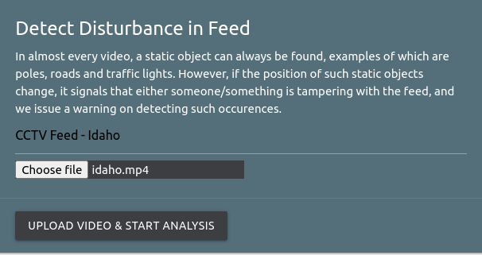

## Prototype for Detecting Earthquakes at the earliest
We developed this prototype while participating in Microsoft's CodeFunDo++ organised in October 2018.

### Motivation
It takes considerable amount of time (as much as 20 minutes) for the disaster management authorities to be notified about any natural disaster that might have taken place [example](https://www.usgs.gov/faqs/how-fast-does-earthquake-information-get-posted-web-site-get-sent-out-earthquake-notification?qt-news_science_products=0#qt-news_science_products).

Our solution involved, using the live feed provided by the government owned surveilance tools (cameras/satelite data) to periodically scanned them frame by frame. The frames captured are checked for any anomalies. If any serious event is detected, the concerned authorities are immediately pinged to look into the situation, and take the required action. Since this is done periodically (say every 30 seconds), the communication gap is bridged between the concerned authorities and the line of action and quick relief can be brought to the affected area.

Another experimental feature of this prototype was to predict earthquakes based on a long standing theory, that animals can often times sense an impending disaster, and start getting fidgety hours before the actual calamity. This is done by capturing animal movements in a zoo/ safari, wherever their movements can be tracked. We track their usual entry and exit from frames and store this information into a database. This data is analysed to observe anomalies and give the concerned authorities time to inform and prepare the public about the for a natural disaster.


## Installation

1. Clone the repo
   ```sh
   git clone https://github.com/yashYRS/DetectEarthquake
   ```
2. Install virtualenv
   ```sh
   python3 -m pip install --user virtualenv
   ```
3. Make a virtual Environnment and activate it
   ```sh
   virtualenv /path_to_env
   source /path_to_env/bin/activate
   ```
5. Install the requirements
   ```sh
   pip install -r requirements.txt 
   ```
6. Make migrations, and run migrate to build a database locally
   ```sh
   python manage.py makemigrations
   python manage.py migrate
   ```
7. Run the server, and open the link mentioned on console to use the application
   ```sh
   python manage.py runserver 
   ```

## Usage

All the functionality provided, that runs on uploaded videos is meant to serve as a proxy, and would have actually run on a live security camera feed.

#### To Monitor movement of animals known to react before earthquakes

Since in most cases of animals being monitored in a controlled environment, the number of such animals appearing in a camera frame is pretty constant. The entry and exit of any moving object is tracked, and severe anomalies are used as indications for a impending disaster.

   
#### To detect disturbances in videos

In almost every video, a static object can always be found, examples of 
which are poles, roads and traffic lights. However, if the position of such 
static objects change, it signals that either someone/something is tampering
with the feed, and we issue a warning on detecting such occurences.




#### View of the Overall Page


#### Example of a Disaster Ping


#### History of all Videos Analyzed

